= JSyntrax
:source-highlighter: highlightjs
:toc: left
:toclevels: 4

== User Guide

=== What is JSyntrax?

https://github.com/atp-mipt/jsyntrax[JSyntrax] is a railroad diagram generator. 
It creates a visual illustration of the grammar used for programming languages.
A specification file describes the syntax as a hierarchy of basic elements. 
This is processed into an image representing the same syntax with interconnected nodes.

The specification is a set of nested Groovy function calls:

[source,Groovy]
----
indentstack(10,
  line(opt('-'), choice('0', line('1-9', loop(None, '0-9'))),
    opt('.', loop('0-9', None))),
  line(opt(choice('e', 'E'), choice(None, '+', '-'), loop('0-9', None)))
)
----

This is processed by JSyntrax to generate an SVG image:

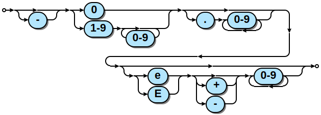

JSyntrax can render to SVG vector images, the output can have <<hyperlinked,hyperlinked text>> allowing users to quickly navigate to documentation of different syntax
elements.

The https://github.com/kevinpt/JSyntrax[original Syntrax] was a heavily modified version of the railroad diagram generator used for the https://www.sqlite.org/lang.html[SQLite documentation] implemented in Python. 
Then in JSyntrax it has been reimplemented in Java in order to simplify installation, get rid of required libraries and make it easily portable to any operating system.

==== JSyntrax vs. Syntrax

Why did you reimplement Syntrax?:: The problem with Syntrax is that it requires Pycairo and Pango which may be difficult to install, especially on Windows. JSyntrax requires only JDK 11, which is easily available for many platforms.

What output formats are supported?:: Unlike original Syntrax, that can output to many bitmap and vector formats, JSyntrax only produces SVG. This can be changed in the future.

Can I build my Syntrax specs with JSyntrax?:: Yes, after only a couple of minor tweaks. If you use url maps, refer to <<hyperlinked,hyperlinked text>> section for Groovy-specific DSL which is a bit different from what was in original Syntrax.

Why your executable file is called `syntrax`?:: This is made intentionally in order to use https://asciidoctor.org/docs/asciidoctor-diagram/[AsciiDoctor Diagram] integration facility. JSyntrax executable has exactly the same command line arguments as Syntrax.

==== Licensing

JSyntrax is licensed for free commercial and non-commercial use under the terms of the MIT license.

=== Requirements, download and installation

JSyntrax requires JDK 11+. No other software is required to run JSyntrax.

You can access the JSyntrax Git repository from
https://github.com/atp-mipt/java-syntrax[Github]. 

Unzip `jsyntrax-XXX.zip` file to any convenient folder. `/bin` directory will contain executable `syntrax` file.

=== Using JSyntrax

JSyntrax is a command line tool. You pass it an input specification file
and it will generate a diagram in any of the supported output formats.

----
usage: syntrax [-h] [-i <arg>] [-o <arg>] [-s <arg>] [--scale <arg>] [-t]
       [--title <arg>]
Railroad diagram generator.
Options
   -h,--help             Show this help message and exit
   -i,--input <arg>      Diagram spec file
   -o,--output <arg>     Output file
   -s,--style <arg>      Style config .ini file
      --scale <arg>      Scale image
   -t,--transparent      Transparent background
      --title <arg>      Diagram title
----

==== Transparency

By default the images have a white background. If you want a transparent background pass the `+-t+` option.

==== Titles

You can include a title in the generated diagram by passing a string to the `+--title+` option. The position of the title is controlled by the `+title_pos+` entry in the styling configuration. It defaults to the top left. 
The `+title_font+` entry is used to style the font.

----
> syntrax -i titling.spec -o svg --title="Diagram with title"
----

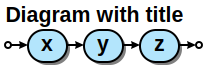

=== Specification language

JSyntrax diagrams are created using a Groovy-based specification
language. 
A series of nestable function calls generate specific diagram elements. 
Nodes in the diagram are represented by quoted strings. 
Nodes default to rounded bubbles but will change to a box when prefixed with "/". 
Note that this is the reverse of how the original SQLite generator works. 
The rounded bubbles are typically used for literal tokens. 
Boxes are typically place holders for syntactic elements too complex to include in the current diagram. 
Nodes starting with a non-alphanumeric character are rendered with their own font style so that punctuation tokens can be made more distinct.

The following functions are available for creating diagrams:

[cols=",,",]
|===
|`line()`  |`loop()`       |`toploop()`
|`choice()`|`opt()`        |`optx()`
|`stack()` |`indentstack()`|`rightstack()`
|===

==== line

A `+line()+` creates a series of nodes arranged horizontally from left
to right.

[source,Groovy]
----
line('[', 'foo', ',', '/bar', ']')
----

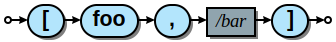

==== loop

A `+loop()+` represents a repeatable section of the syntax diagram. It
takes two arguments. The first is the line of nodes for the forward path
and the second is the nodes for the backward path. The backward path is
rendered with nodes ordered from right to left.

[source,Groovy]
----
loop(line('/forward', 'path'), line('backward', 'path'))
----

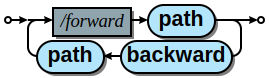

Either the forward or backward path can be `+None+` to represent no
nodes on that portion of the loop.

[source,Groovy]
----
loop('forward', None)
----

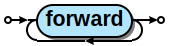

==== toploop

A `+toploop()+` is a variant of `+loop()+` that places the backward path
above the forward path.

[source,Groovy]
----
toploop(line('(', 'forward', ')'), line(')', 'backward', '('))
----

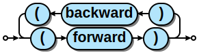

==== choice

The `+choice()+` element represents a branch between multiple syntax
options.

[source,Groovy]
----
choice('A', 'B', 'C')
----

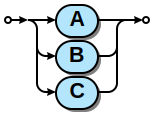

==== opt

An `+opt()+` element specifies an optional portion of the syntax. The
main path bypasses the optional portion positioned below.

[source,Groovy]
----
opt('A', 'B', 'C')
----

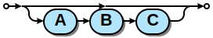

`+opt()+` is a special case of the `+choice()+` function where the first
choice is `+None+` and the remaining nodes are put into a single line
for the second choice. The example above is equivalent the following:

[source,Groovy]
----
choice(None, line('A', 'B', 'C'))
----

==== optx

The `+optx()+` element is a variant of `+opt()+` with the main path
passing through the nodes.

[source,Groovy]
----
optx('A', 'B', 'C')
----

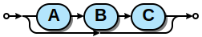

==== stack

The elements described above will concatenate indefinitely from left to
right. To break up long sections of a diagram you use the `+stack()+`
element. Each of its arguments forms a separate line that is stacked
from top to bottom.

[source,Groovy]
----
stack(
  line('top', 'line'),
  line('bottom', 'line')
)
----

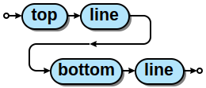

When an inner element of a stack argument list is an `+opt()+` or an
`+optx()+` it will be rendered with a special vertical bypass.

[source,Groovy]
----
stack(
  line('A', 'B'),
  opt('bypass'),
  line('finish')
)
----

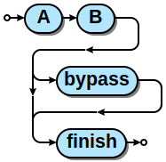

==== indentstack

For more control of the stacking you can use the `+indentstack()+`
element. It shifts lower lines to the right relative to the top line of
the stack. Its first argument is an integer specifing the amount of
indentation.

[source,Groovy]
----
indentstack(3,
  line('top', 'line'),
  line('bottom', 'line')
)
----

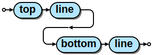

==== rightstack

The `+rightstack()+` element will right align successive lines without
needing to determine the indentation.

[source,Groovy]
----
rightstack(
  line('top', 'line', 'with', 'more', 'code'),
  line('bottom', 'line')
)
----

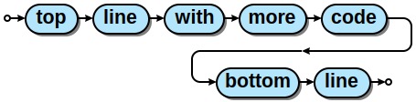

=== Styling diagrams

You can control the styling of the generated diagrams by passing in a
style INI file with the `+-s+` option. By default JSyntrax will look for
a file named "JSyntrax.ini" in the current directory and use that if it
exists. Otherwise it will fall back to its internal defaults.

You can use the `+--get-style+` option to generate a copy of the default
styles in the current directory so you can quickly make modifications.

Here is the default styling:

----
[style]
line_width = 2
outline_width = 2
padding = 5
line_color = (0, 0, 0)
max_radius = 9
h_sep = 17
v_sep = 9
arrows = True
title_pos = 'tl'
bullet_fill = (255, 255, 255)
text_color = (0, 0, 0)
shadow = True
shadow_fill = (0, 0, 0, 127)
title_font = ('Sans', 22, 'bold')

[bubble]
pattern = '^\w'
shape = 'bubble'
text_mod = None
font = ('Sans', 14, 'bold')
text_color = (0, 0, 0)
fill = (179, 229, 252)

[box]
pattern = '^/'
shape = 'box'
text_mod = 'lambda txt: txt[1:]'
font = ('Times', 14, 'italic')
text_color = (0, 0, 0)
fill = (144, 164, 174)

[token]
pattern = '.'
shape = 'bubble'
text_mod = None
font = ('Sans', 16, 'bold')
text_color = (0, 0, 0)
fill = (179, 229, 252)
----

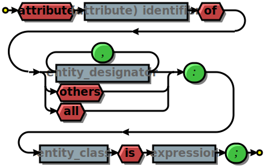

Here is the same diagram with modified styling:

----
[style]
line_width = 3               ; Thicker lines
outline_width = 3
padding = 5
line_color = (0, 0, 0)
max_radius = 29              ; Larger radii
h_sep = 17
v_sep = 9
arrows = False               ; Remove arrows
title_pos = 'tl'
bullet_fill = 'yellow'       ; Requires optional webcolors package to be installed
text_color = (0, 0, 0)
shadow = True
shadow_fill = (0, 0, 0, 127)
title_font = ('Sans', 22, 'bold')

[hex_bubble]                 ; User-defined style name
pattern = '^\w'
shape = 'hex'                ; Hexagon shape for node
font = ('Sans', 14, 'bold')
fill = (255,0,0,127)         ; Alpha component for transparent fills

[box]
pattern = '^/'
shape = 'box'
text_mod = 'lambda txt: txt[1:]'
font = ('Sans', 14, 'bold')
text_color = (100, 100, 100)
fill = '#88AAEE'

[token]
pattern = '.'
shape = 'bubble'
font = ('Times', 16, 'italic')
fill = (0,255,0,127)
----

image:images/vhdl_attribute_alt.svg[image]

The style configuration file has a main section named "[style]" followed by user-defined sections for various node types. 
The node style is chosen based on a regex pattern applied to the text. The first matched pattern sets the style for a node. 
Patterns are tested in the same order they appear in the configuration file. 
The first node style is used by default if no pattern matched the text.

The `+[style]+` section contains the following keys:

line_width::
Connecting line width in pixels. 
Default is 2.

outline_width::
Node outline width in pixels. 
Default is 2.

padding::
Additional padding around each edge of the image in pixels. 
Default is5.

line_color::
Color of the connecting lines and node outlines. 
Default is (0,0,0) Black.

max_radius::
Maximum radius for turnbacks on loops and stacked connections.

h_sep::
Horizontal separation between nodes.

v_sep::
Vertical separation between line elements.

arrows::
Boolean used to control rendering of line arrows. 
Default is True.

title_pos::
Position of the title text. 
String containing one of 'left', 'center', or 'right' for horizontal position and 'top' or 'bottom' for vertical.
These can be abbreviated as 'l', 'c', 'r', 't', and 'b'. 
Other characters are ignored. 
Examples are 'top-left', 'bottom center', 'cr', and 'rt'.

bullet_fill::
Fill color for small bullets at start and end of the diagram.

text_color::
Default color of all text. Can be overridden with `+text_color+` in a
node style section

shadow::
Boolean controlling the rendering of node shadows. Default is True.

shadow_fill::
Fill color for shadows.

title_font::
Font for image title.

==== Node styles

Nodes are styled with a user-defined section name. 
The built-in sections are `+[bubble]+` for tokens that start with an alphanumeric character, `+[box]+` for symbols drawn with a boxed outline, and `+[token]+` for tokens that consist of a single punctuation character. 
You are not limited to these three node styles. 
Any number of node types can be defined provided they have distinct patterns to match against the node text in your specification file.

The node sections contain the following keys:

pattern::
A regex pattern to match the node text to a style.

shape::
Node outline shape. Must be "bubble", "box", or "hex".

text_mod::
Optional lambda expression for transforming text from the specification into the output diagram. 
This allows you to include additional characters to match against to select the node type and then remove them from the final diagram. 
It takes the node text string as a single argument and returns the modified text.

font::
Font style for the node.

text_color::
Optional font color for the node. 
If omitted, the `+text_color+` from the `+[style]+` section is used.

fill::
Shape fill color for the node.

[NOTE]
.Note
====
The `+text_mod+` value is passed through `+eval()+` to create an
executable code object. 
This is a potential security hole if an
untrusted user is allowed to control the style settings file.
====

==== Colors

The various keys controlling coloration can use a variety of color
formats. 
The primary color representation is a 3 or 4-tuple representing RGB or RGBA channels. 
All channels are an integer ranging from 0 to 255.

----
; Supported color formats:

(255,100,0)     ; RGB 
(255,100,0,100) ; RGBA 
'#AABBCC'       ; Hex string 
'red'           ; Named web color
----

==== Fonts

Fonts are specified as a tuple of three items in the following order:

* Font family (Helvetica, Times, Courier, etc.)
* Point size (12, 14, 16, etc.)
* Style ('normal', 'bold', 'italic')

title_font = ('Helvetica', 14, 'bold')

[hyperlinked]
=== Hyperlinked SVG

SVG images can have hyperlinked node text. This is implemented by adding a `+url_map+` parameter to `jsyntrax` wrapper function. 
The keys of the dictionary are the text identifying the node and their values are the URL for the link. 
The text key should not include any leading "/" character for the box nodes.

[source,Groovy]
----
jsyntrax(stack(
 line('attribute', '/(attribute) identifier', 'of'),
 line(choice(toploop('/entity_designator', ','), 'others', 'all'), ':'),
 line('/entity_class', 'is', '/expression', ';')
), 
[
  'entity_class': 'https://www.google.com/#q=vhdl+entity+class',
  '(attribute) identifier': 'http://en.wikipedia.com/wiki/VHDL'
])
----

[NOTE]
.Note for Syntrax (Python) users
====
Note that in Groovy, unlike Python, maps are enclosed in brackets `[]`, not braces `{}`.
====

Current browser policies lump SVG hyperlinks together with embedded
Javascript. 
Because of this they do not support hyperlinks when an SVG
is referenced through an HTML `++` tag. 
To get functional links on a web page you must use an `+<object>+` tag instead:

[source,html]
----
<object type="image/svg+xml" data="path/to/your.svg"></object>
----
